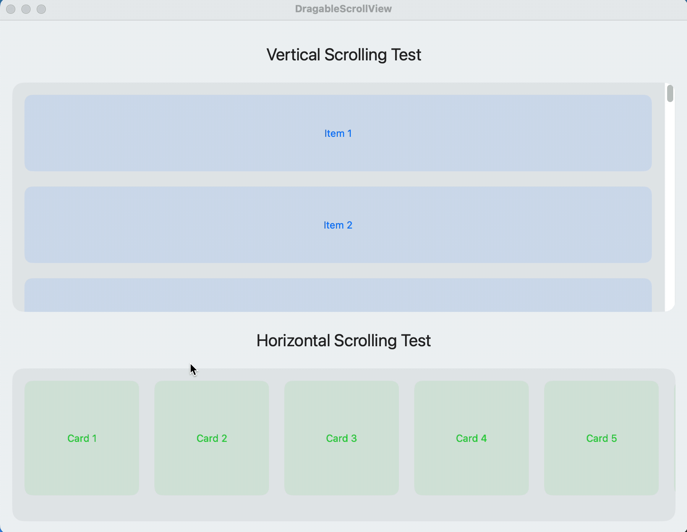

# DraggableScrollView

A highly customizable SwiftUI scroll view component that supports mouse drag interactions with inertial scrolling and bounce effects, similar to touch-based scrolling on iOS devices.

## Screenshots



*DraggableScrollView Demo - Showing scrolling, bounce, and inertial effects*

## Features

- 🖱️ Mouse drag-based scrolling
- 🔄 Smooth inertial scrolling
- 🎯 Precise boundary handling
- 💫 Natural bounce effects
- ↔️ Support for both horizontal and vertical scrolling
- 📏 Automatic content size detection
- 🎨 Customizable scroll indicators
- 🎮 Configurable scroll speed and momentum

## Requirements

- iOS 14.0+ / macOS 11.0+
- Swift 5.5+
- Xcode 13.0+

## Installation

### Swift Package Manager

Add the following to your `Package.swift` file:

```swift
dependencies: [
    .package(url: "https://github.com/torresslol/DraggableScrollView.git", from: "1.0.0")
]
```

### Manual Installation

Simply copy the `DraggableScrollView.swift` file into your project.

## Usage

```swift
import SwiftUI

struct ContentView: View {
    var body: some View {
        // Horizontal scrolling
        DraggableScrollView(axes: .horizontal) {
            HStack(spacing: 20) {
                ForEach(0..<20) { index in
                    RoundedRectangle(cornerRadius: 10)
                        .fill(Color.blue.opacity(0.1))
                        .frame(width: 150, height: 150)
                        .overlay(Text("Card \(index + 1)"))
                }
            }
            .padding()
        }
        .frame(height: 200)
        
        // Vertical scrolling
        DraggableScrollView(axes: .vertical) {
            VStack(spacing: 20) {
                ForEach(0..<30) { index in
                    RoundedRectangle(cornerRadius: 10)
                        .fill(Color.green.opacity(0.1))
                        .frame(height: 100)
                        .overlay(Text("Item \(index + 1)"))
                }
            }
            .padding()
        }
        .frame(height: 300)
    }
}
```

## Customization

The `DraggableScrollView` can be customized with several parameters:

```swift
DraggableScrollView(
    axes: .horizontal,              // Scroll direction
    showsIndicators: true,         // Show/hide scroll indicators
    @ViewBuilder content: { ... }  // Your content
)
```

## How It Works

The `DraggableScrollView` uses SwiftUI's gesture system to handle mouse drag interactions and implements custom physics for inertial scrolling. It features:

- Automatic content size detection using GeometryReader and PreferenceKey
- Smooth velocity calculations for natural inertial scrolling
- Boundary detection with bounce-back effects
- Optimized performance with minimal redraws

## Contributing

Contributions are welcome! Please feel free to submit a Pull Request.

## License

This project is licensed under the MIT License - see the [LICENSE](LICENSE) file for details.

## Acknowledgments

- Inspired by iOS's native scroll view behavior
- Built with SwiftUI's latest features
- Special thanks to the SwiftUI community

## Support

If you found this project helpful, please give it a ⭐️ on GitHub! 
